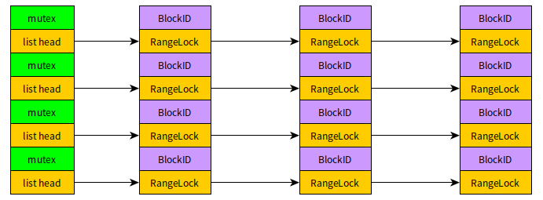

PFS 4K原子写实现
===============

问题背景
-------

PFS以4K为单位写盘，并且以最大16K作为一个族往下写，这个族是定义好的，也可以在编译时修改，
例如修改成64K。PFS原来是为数据库设计的，而数据库通常自己管理缓存，也会以4K的倍数写盘，例如
mysql innodb一个page是16K, 会以16K的倍数写盘。

当我们要把PFS作为curvebs后端存储引擎，以直接与NVME对话，绕过OS时，由于curvebs可能会面对512
字节为倍数的写盘，而此时PFS的小于4K写的非原子性问题，可能会面临并发写4K内部时，有数据丢失风险。
为了解决这个问题，特意加上范围锁。

目标
---

解决小于4K写的原子性问题，并且开销比较小。

策略
---

PFS是以4M为单位分配文件存储空间的，这个4M范围是我们定义锁冲突域的关键，由于每一个4M有一个BlockID,
我们可以以此ID为索引，在一个hash table中，查找潜在冲突者。锁用一个RangeLock来表示。

RangeLock对象支持范围锁，范围锁的参数是(start offset, end offset, 读写模式(R/W))

当我们要对一个4M块发起写操作时，先在hash table中查找这个RangeLock对象，如果不存在就插入
一个新的RangeLock对象。每一个要操作这个RangeLock的线程，都会对RangeLock对象增加一个引用计数器，
当不需要时就减少引用计数器，如果到0,就回收这个RangeLock对象。

写操作时，先获得RangeLock对象，
然后根据4M内的写入范围，可能存在三个锁区间：


1. 开头部分，在一个4K内部分写。
2. 中间部分，完全以4K为单位。
3. 末尾部分，在一个4K内部分写。

开头部分需要先读入再合并用户数据，然后回写，所以需要以写锁方式锁定这个区域，避免并发。
中间部分，以读锁的方式锁定，并发的4K对齐倍数写可以互相共存。
末尾部分与开头部分一样，也需要先读入再合并用户数据再回写，所以也需要写锁独占。

设计与实现
--------

1. hash table的设计

   hash table设计成bucket方式，每个bucket是一个link list，同时配以mutex锁。

   

寻找bucket需要hash函数，可以使用<b>唐纳德·克努特</b>函数：
```
#define GOLDEN_RATIO_64 0x61C8864680B583EBull
static inline uint32_t hash_64(uint64_t val, unsigned int bits)                 
{                                                                               
        return val * GOLDEN_RATIO_64 >> (64 - bits);                            
}
```
bits表示桶的个数(2为底的对数)，例如1024个，就是10。上面的hash函数把BlockID到桶的计算打乱，
以免有规律的BlockID在同一个桶上。

2. RangeLock对象的实现

RangeLock代码主要是借用了FreeBSD的代码，<a href="https://github.com/freebsd/freebsd-src/blob/main/sys/kern/kern_rangelock.c"> https://github.com/freebsd/freebsd-src/blob/main/sys/kern/kern_rangelock.c </a>

该代码的特点是简单。它使用链表和顺序搜索，考虑到4M的范围很小，通常没有那么多高并发IO, 所以线性搜索是可行的，代码容易理解和维护。

3. RangeLock对象的内存管理

由于每次在hash table中插入一个新对象都要申请一个RangeLock，malloc的负担过重，为此特别设计一个
无锁stack用于保存刚释放的对象，当要申请一个对象时，先从这个stack里拿，如果失败再用malloc申请。
无锁stack是dpdk提供的。虽然无锁stack性能很好，但是还有优化空间，可以在线程局部数据里cache几个，
以备将来使用。所以申请过程变成：

```
  从线程局部数据区里拿 --> 从共享的无锁stack里拿 --> malloc申请
```

4. 锁过程示例：

下面的函数实现4M内的锁：
```
static void                                                                     
pfs_block_lock(pfs_mount_t *mnt, int64_t blkno, off_t woff,                     
        size_t wlen, struct rangelock **rlp, void *cookie[], int *cc)           
{              
        // 获得设备的扇区大小（假设4k)
        const size_t dev_bsize = pfsdev_get_write_unit(mnt->mnt_ioch_desc);
        off_t lock_start = woff, lock_mid_end = 0, lock_end = woff + wlen;      
        struct rangelock *rl = NULL;                                            
        pthread_mutex_t *mtx = NULL;                                            

        *cc = 0;
        //查询hashtable获得RangeLock对象，传入参数blkno是BlockID
        rl = pfs_locktable_get_rangelock(mnt->mnt_locktable, blkno);

        // 获得RangeLock的保护mutex
        mtx = &rl->rl_mutex;                                                    
        pthread_mutex_lock(mtx);

        //要写头段？非4K对齐部分写
        if (lock_start & (dev_bsize-1)) {
                // 截断到4k开始处
                lock_start = RTE_ALIGN_FLOOR(lock_start, dev_bsize);
                // 以写方式锁住这个4K
                cookie[*cc] = pfs_rangelock_wlock(rl, lock_start,               
                        lock_start + dev_bsize, mtx);

                // 移动到中间段开始位置
                lock_start += dev_bsize;                                        
                *cc = *cc + 1;
        }                                                                       

        //要写中间段 ？计算中间段结束位置。
        lock_mid_end = RTE_ALIGN_FLOOR(lock_end, dev_bsize);                    
        if (lock_start < lock_mid_end) {
                // 中间段存在，以共享方式打开锁，此时允许其他并发整4k写
                cookie[*cc] = pfs_rangelock_rlock(rl, lock_start,               
                        lock_mid_end, mtx);                                     
                *cc = *cc + 1;                                                  
        }                                                                       

        //要写尾部？有尾部非4K写吗？
        if (lock_mid_end < lock_end) {                         
                // 上溢到整4k边界，锁住整个4K
                lock_end = RTE_ALIGN_CEIL(lock_end, dev_bsize);
                cookie[*cc] = pfs_rangelock_wlock(rl, lock_mid_end,             
                         lock_end, mtx);                                        
                *cc = *cc + 1;                                                  
        }                                                                       
        pthread_mutex_unlock(mtx);                                              
        *rlp = rl;                                                              
}                                                                               

```

5. 性能测试

主机：prit1-curve-chunk-node20
NVME： 三星1.7T
```
[global]
ioengine=pfs
cluster=spdk
pbd=0000:81:00.0n1
filename=/0000\:81\:00.0n1/fio-seq-write
size=10G
bs=4096
direct=1
[randwrite]                                                                     
rw=randwrite                                                                    
iodepth=1                                                                       
size=5G                                                                         
numjobs=50                                                                      
runtime=600                                                                     
group_reporting
```

在关闭和打开RangeLock的情况下，都是平均112K IOPS左右。 几乎看不出对性能的影响。

6. 配置

全局变量io_atomic控制RangeLock如何起作用。如果是0, 则自动判断设备是否支持512字节对齐写，
如果支持，RangeLock不起作用，这适合做Chunkserver的存储引擎。
如果设置为1, 则总是启用，这适合作为普通文件系统使用。
